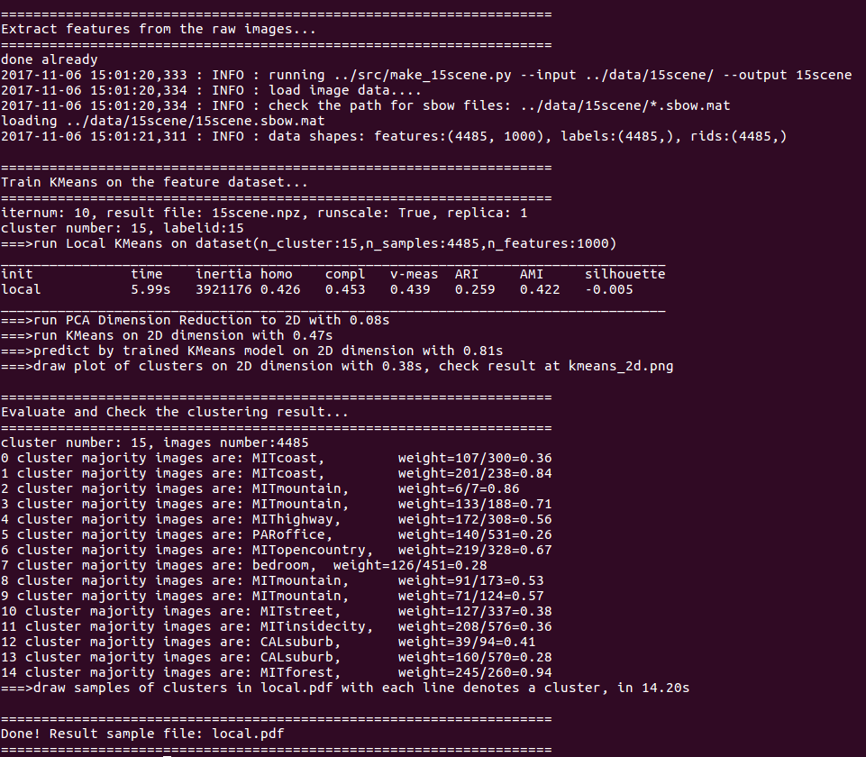

# Python part another version

## Invoke Harp-DAAL K-means via Python Interface 

Besides, the Java programming API, Harp-DAAL currently provides another Python API, which interfaces 
Harp-DAAL with other python written applications. By just adding several lines of python code, you 
are able to deploy the original python application on Hadoop Cluster and boost the performance by 
leveraging DAAL kernels. 

The python codes for image clustering is located at the path

```bash
${PYTHONPATH}/examples/scdemo/tutorial
```

### Step.1 Run NaiveBayes on 20news Dataset with Python Scikit-Learn 

Run the pipeline from feature extraction, training, evaluation and finally check the clusters results.

```python
cd ${PYTHONPATH}/examples/scdemo/test
../tutorial/run_nb.sh
```



### Step.2 Modify to invokes Harp-DAAL

*demo_nb_local.py* is the original python codes of classification without Harp-DAAL. 
```python
# ############################################################################
# call NaiveBayes module 
# ############################################################################
BernoulliNB()
```
*demo_nb_daal.py* replaces the above NaiveBayes module by a Harp-DAAL invocation

```python
# ############################################################################
# call Harp-DAAL NaiveBayes module 
# ############################################################################
DAALNavieBayes(n_node = 1, n_thread = 8, workdir='/20news/')
```

View all the modifications by
```bash
diff ../tutorial/demo_nb_local.py ../tutorial/demo_nb_daal.py
```

### Step.3 Invokes Harp-DAAL

```bash
../tutorial/run_nb.sh daal
```

### Step.4 Check the results of performance

Download the result files, naivebayes_perf_{local}{daal}.png

